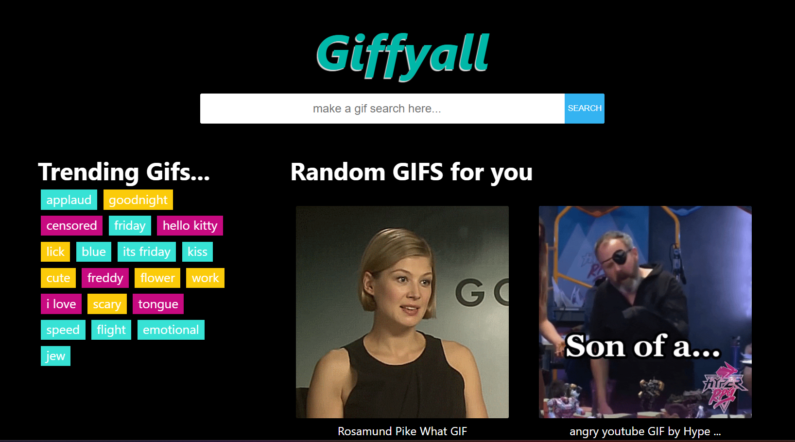

# Giffyall

Learning React project for searching and browsing GIFs with GIPHY.

## Screenshots

### Home


### Single GIF Detail


## Features
- Trending searches
- GIF search by term
- Infinite scroll list
- Detail page for a single GIF

## Stack
- React 18
- React Router DOM 6
- styled-components
- Create React App

## Run Locally
```bash
npm install
npm start
```

Open `http://localhost:3000`.

## Build
```bash
npm run build
```

## Environment Variables
Create a `.env` file in the project root with:

```env
REACT_APP_BASE_URL=https://api.giphy.com/v1/gifs
REACT_APP_API_KEY=?api_key=YOUR_GIPHY_API_KEY
```

Important:
- variables must start with `REACT_APP_` in Create React App
- restart the dev server after changing `.env`

## Notes
- This is a learning project and intentionally simple.
- Vercel builds run in CI mode, so lint warnings can fail the build.
